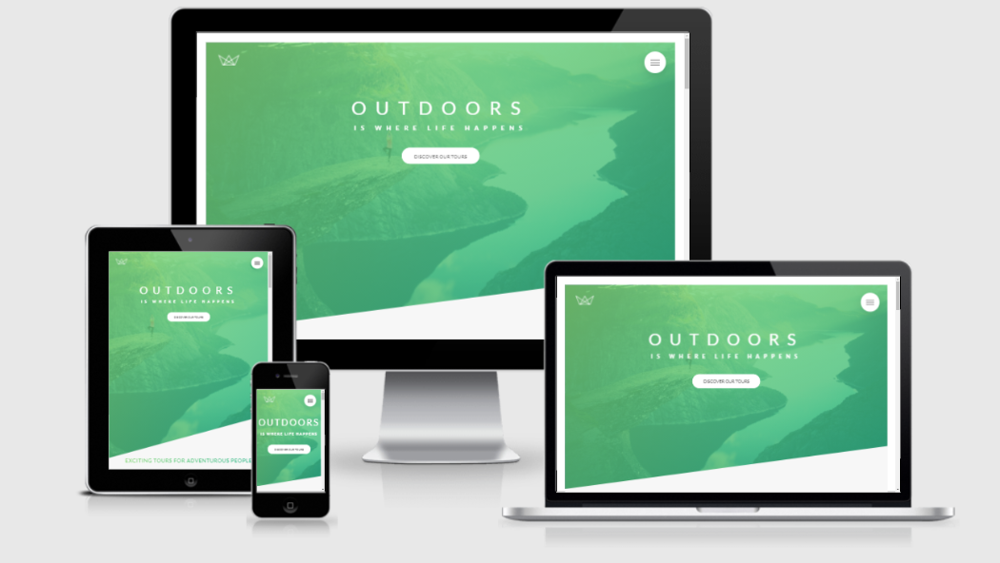

# Natours

Welcome to Natours, a fictional website designed for adventurous souls seeking unforgettable tour experiences. This project serves as a learning platform for advanced CSS techniques and SASS implementation, showcasing how to create a visually appealing and responsive design for a larger web application.

The site features a modern layout, smooth animations, and an intuitive user interface, all aimed at providing a seamless experience for users exploring various adventure tours. Through this project, I've honed my skills in front-end development, focusing on best practices and efficient styling methods.

## Features

- BEM implementation
- Advance CSS And SASS Features
- Animations without Js
- Desktop Approch
- Responsive Grid System

## Demo



## Implements 7-1 SASS Architecture

```yml
sass/
|
|– abstracts/
|   |– _variables.scss    # Sass Variables
|   |– _functions.scss    # Sass Functions
|   |– _mixins.scss       # Sass Mixins
|   |– _map.scss          # Sass map
|
|– base/
|   |– _animation.scss    # Animations
|   |– _typography.scss   # Typography rules
|   |- _utillities.scss   # Utillities classes
|   |- _base.scss         # Base
|
|– components/
|   |– _buttons.scss      # Buttons
|   |– _bg-video.scss     # bg-video
|   |– _card.scss         # Card
|   |– _form.scss         # form
|   …                     # Etc.
|
|– layout/
|   |– _navigation.scss   # Navigation
|   |– _grid.scss         # Grid system
|   |– _header.scss       # Header
|   |– _footer.scss       # Footer
|   …                     # Etc.
|
|– pages/
|   |– _home.scss         # Home specific styles
|
|– themes/
|   |– _theme.scss        # Default theme
|   |– _admin.scss        # Admin theme
|   …                     # Etc.
|
|– vendors/
|   |– _bootstrap.scss    # Bootstrap
|   |– _jquery-ui.scss    # jQuery UI
|   …                     # Etc.
|
`– main.scss              # Main Sass file
```

## Key Learnings

- **Advanced CSS Concepts:** Gained expertise in modern CSS techniques for building responsive and visually appealing layouts.

- **SASS Mastery:** Implemented the SASS 7-1 architecture to organize styles efficiently, promoting scalability and maintainability.

- **BEM Methodology:** Adopted the BEM naming convention for structuring CSS classes, enhancing readability and project organization.

- **Responsive Design:** Ensured the website is fully responsive across all devices using flexible grid layouts and responsive images.

- **Flexible Units:** Utilized rem and em units instead of pixels for better scalability and accessibility.

- **Interactive Card Component:** Developed a card that flips on hover, demonstrating CSS transitions and transformations.

- **Animated Navigation Button:** Created a navigation button with engaging animations and effects, improving user interaction.

- **Popup Modal Window:** Designed a popup modal without relying on JavaScript, showcasing advanced CSS techniques for interactivity.

## Contributing

Contributions are welcome! If you'd like to contribute, please fork the repository and create a pull request. For major changes, please open an issue first to discuss what you would like to change.

## Acknowledgments

- This website was created during the Advanced CSS and SASS course by Jonas Schmedtmann. I undertook this project to deepen my understanding of SASS and advanced CSS concepts. The course provided invaluable insights and techniques that greatly influenced the development of this project.

`Feel free to adjust any part of this to better fit your style or add more details as needed. If you have anything else to include or modify, just let me know!`
